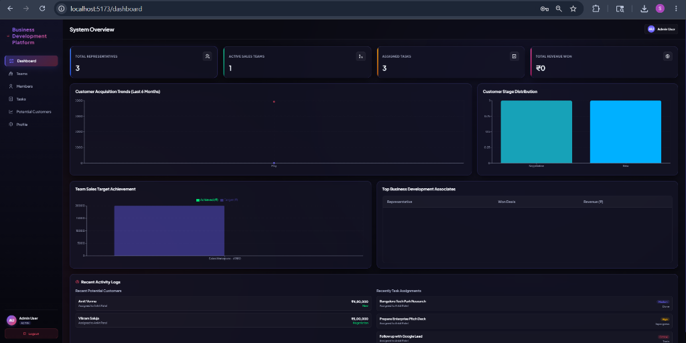
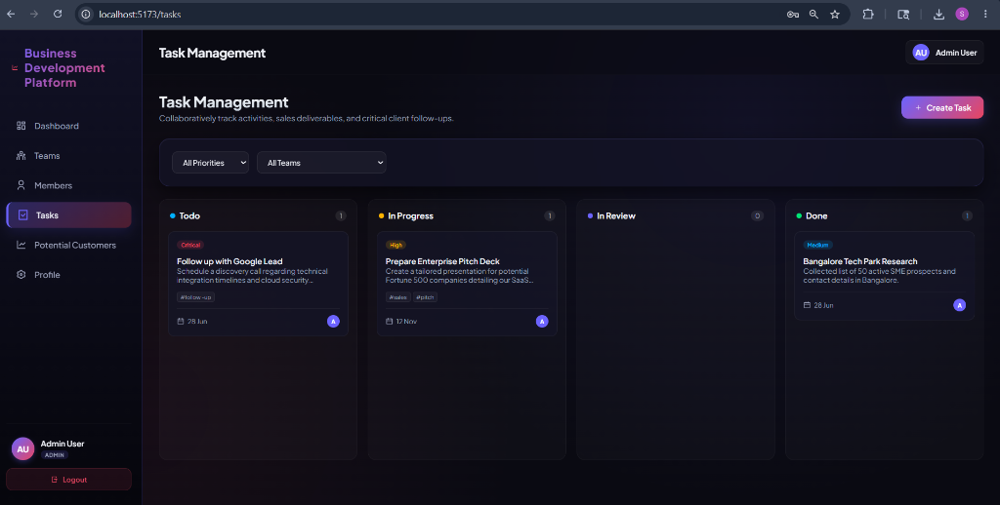
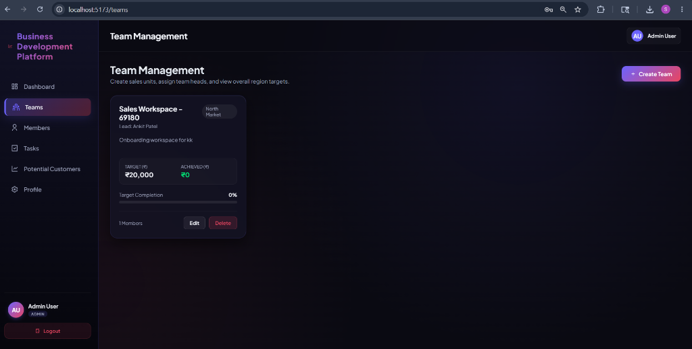
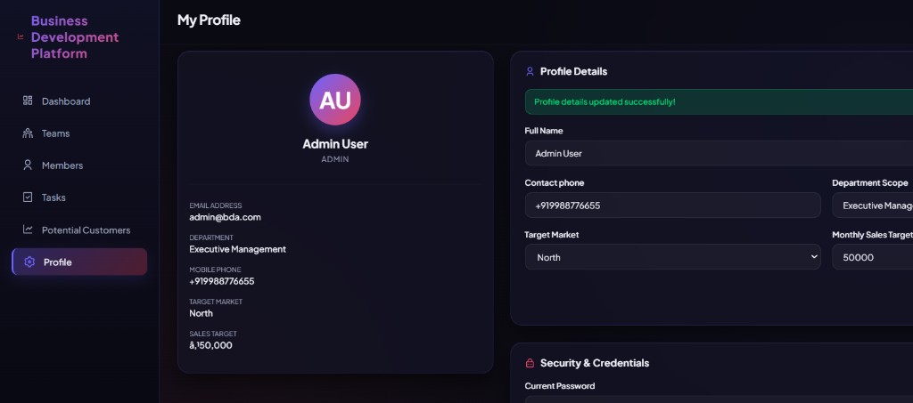

# BDA Team Management System

A full-stack **Business Development Associate (BDA) Management Platform** built with the MERN stack (MongoDB, Express.js, React, Node.js). This CRM-style application helps organizations manage their sales teams, track potential customers through a sales pipeline, and boost productivity with AI-powered tools.

## ✨ Features

### 🔐 Authentication & Roles
- JWT-based login/register system
- Three user roles: **Admin**, **Team Manager**, **Business Development Associate**
- Role-based access control on all routes

### 📊 Dashboard & Analytics
- Real-time stats: Total Revenue, Potential Customers, Active Tasks, Active Teams
- Interactive charts (Pipeline Distribution, Team Performance)
- Top Business Development Associates leaderboard

### 👥 Team Management
- Create and manage sales teams
- Assign managers and team members
- Track team-level sales targets and achievements

### 📋 Task Management
- Create, assign, and track tasks
- Kanban-style status tracking (To Do, In Progress, Review, Done)
- Priority levels and due dates

### 🎯 Lead / Potential Customer Management
- Full sales pipeline: New → Contacted → Qualified → Proposal → Negotiation → Won/Lost
- Track deal values, sources, and follow-up dates
- Filter by status, source, and search by name

### 🌐 Public Contact Page
- Public-facing `/contact` page (no login required)
- Customers can submit inquiries directly
- Submissions automatically appear as new leads in the CRM

### 🤖 AI Email Drafter (Grok AI)
- One-click AI-generated follow-up emails for any lead
- Powered by Grok (xAI) API
- Personalized based on customer name, company, and discussion notes
- Copy-to-clipboard functionality

## 🛠️ Tech Stack

| Layer | Technology |
|-------|-----------|
| Frontend | React 18, Vite, React Router v6 |
| Backend | Node.js, Express.js |
| Database | MongoDB Atlas (Mongoose ODM) |
| Auth | JWT (JSON Web Tokens), bcrypt |
| AI | Grok API (xAI) |
| Styling | Custom CSS with Glassmorphism design |
| Charts | Recharts |

## 🚀 Getting Started

### Prerequisites
- Node.js (v18 or above)
- MongoDB Atlas account (free tier works)
- Grok API key (optional, for AI features)

### 1. Clone the Repository
```bash
git clone https://github.com/YOUR_USERNAME/bda-team-management.git
cd bda-team-management
```

### 2. Setup Backend
```bash
cd backend
npm install
```

Create a `.env` file in the `backend/` folder (see `.env.example`):
```
PORT=5000
MONGO_URI=your_mongodb_connection_string
JWT_SECRET=your_secret_key
JWT_EXPIRE=7d
NODE_ENV=development
GROK_API_KEY=your_grok_api_key
```

Start the backend:
```bash
npm run dev
```

### 3. Setup Frontend
```bash
cd frontend
npm install
npm run dev
```

### 4. Open in Browser
- Frontend: `http://localhost:5173`
- Backend API: `http://localhost:5000`
- Public Contact Page: `http://localhost:5173/contact`

## 📁 Project Structure
```
bda-team-management/
├── backend/
│   ├── config/          # Database connection
│   ├── controllers/     # Business logic (auth, leads, tasks, AI)
│   ├── middleware/       # JWT auth & error handling
│   ├── models/          # MongoDB schemas (User, Lead, Task, Team)
│   ├── routes/          # API endpoints
│   ├── utils/           # Seeder & helpers
│   └── server.js        # Express app entry point
├── frontend/
│   ├── src/
│   │   ├── api/         # Axios instance
│   │   ├── components/  # Reusable UI (Layout, Sidebar, Table, Modal)
│   │   ├── context/     # Auth context (React Context API)
│   │   ├── pages/       # All page components
│   │   └── App.jsx      # Router setup
│   └── index.html
└── README.md
```

## 🔑 Default Admin Credentials
```
Email: admin@bda.com
Password: password123
```

## 📸 Application Walkthrough

### 📊 Executive Analytics Dashboard
A comprehensive view of the sales pipeline, team performance, lead distributions, and real-time activity logs.


### 📋 Kanban Task Management
Visual task allocation and tracking across customizable stages (To Do, In Progress, Review, Done) with priority indicators.


### 👥 Team Target Coordination
Enables administrators and managers to monitor regional sales targets, track achievement percentages, and configure member structures.


### 👤 User Profile & Workspace Details
Allows team members to manage contact information, check department scopes, and view individual sales targets.


## 📄 License
This project is for educational purposes.
